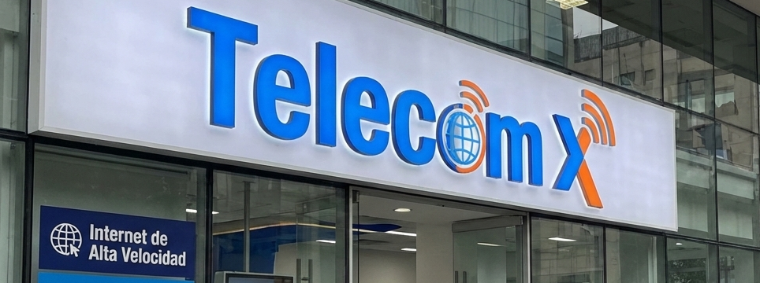
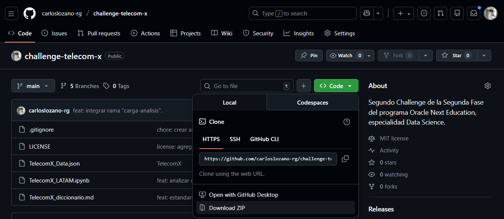

# Challenge Telecom X Modelo Predictivo
Este repositorio representa el Tercer Challenge de la Segunda Fase del programa Oracle Next Education, especialidad Data Science impartido por Oracle y Alura Latam.

## Índice
- [Descripción del Proyecto](#descripción-del-proyecto)
    - [Contexto](#contexto)
    - [Antecedentes](#antecedentes)
    - [Objetivo](#objetivo)
    - [Conjunto de Datos o Dataset](#conjunto-de-datos-o-dataset)
- [Organización de los Archivos](#organización-de-los-archivos)
- [Flujo de trabajo](#flujo-de-trabajo)
- [Comenzando](#comenzando)
    - [Pre-Requisitos](#pre-requisitos)
    - [Instalación](#instalación)
    - [Entorno Virtual](#entorno-virtual-venv)
    - [Instalación de Dependencias](#instalación-de-dependencias)
- [Tecnologías utilizadas](#tecnologías-utilizadas)
- [Estado del proyecto](#estado-del-proyecto)
- [Acceso al Proyecto](#acceso-al-proyecto)
- [Licencia](#licencia)
- [Personas Desarrolladoras del Proyecto](#personas-desarrolladoras-del-proyecto)

## Descripción del Proyecto

### Contexto
El proyecto propone una situación ficticia donde hemos sido contratados como **analistas de datos** para trabajar específicamente en el 'churn' o cancelaciones de clientes de la empresa Telecom X.

### Antecedentes
Este proyecto es una continuación del proyecto [challenge-telecom-x](https://github.com/carloslozano-rg/challenge-telecom-x.git), en el cual: 
- Realizamos un tratamiento a los datos.
- Desarrollamos un análisis exploratorio.
- Descubrimos algunos insigths importantes. 
- Proporcionamos algunas recomendaciones de como tratar la raíz del problema.

### Objetivo
La empresa quiere anticiparse al problema de la cancelación, por lo que la misión que nos han asignado es es **desarrollar modelos predictivos** capaces de prever qué clientes tienen mayor probabilidad de cancelar sus servicios.

### Conjunto de Datos o Dataset
El dataset que vamos a ocupar fue producto del tratamiento de los datos del proyecto [challenge-telecom-x](https://github.com/carloslozano-rg/challenge-telecom-x.git), del DataFrame **telecom_x_estandarizado**, el cual fue convertido a formato csv con el nombre de **'datos_telecom_x.csv'**.
Se realizaron los siguientes tratamientos sobre los datos originales:
- Se eliminaron registros que contenian un carácter vacío en la columna **'cancelacion'**, ya que: 
    - era una columna muy importante para no saber si el cliente había cancelado o no su servicio,
    - y representaban menos del 3% del total.
- Se introdujeron ceros en los registros con un carácter vacío en la columna **'cargo_total'**, ya que representaban a clientes que apenas comenzaban con su servicio.
- Se tradujeron los nombres de varias columnas para mayor claridad.

## Organización de los Archivos
- `datos_telecom_x.csv`: conjunto de datos usado en modelo predictivo.
- `diccionario_telecom_x.md`: diccionario de variables o columnas del conjunto de datos.
- `Telecom_X_Modelo_Predictivo.ipynb`: libreta principal que contiene el desarrollo del modelo predictivo.
- `requirements.txt`: archivo de texto que contiene las dependencias necesarias para repoducir un entorno virtual ideal para este proyecto.
- `assets`: carpeta con imágenes.
- `.gitignore`: archivo para ignorar ciertos archivos dentro del repositorio.
- `LICENSE`: licencia del proyecto.
- `README.md`: archivo introductorio del proyecto.

## Flujo de Trabajo
El **flujo de trabajo** se baso en el Trello proporcionado por Alura: <https://trello.com/b/y1FQQnc7/telecomxparte2latam>, por lo que se puede llegar un resultado similar.
1. Preparación de ambiente virtual (venv).
2. Exploración de dataset.
3. Análisis de correlación de variables.
4. Análisis de exploratorio de variables relevantes para la cancelación.
5. Codificación de datos.
6. Construcción de Modelos:
    - Normalización.
    - Balanceo de clases.
    - Validación cruzada.
    - Evaluación de modelos.
7. Optimización de Variables.
8. Conclusiones y recomendaciones.

## Comenzando

### Pre-Requisitos
- Puedes elegir cualquier editor de código fuente para trabajar con este repositorio.
Mi recomendación es usar **Visual Studio Code**.
- **Python** 3+.
- **Git** 2.5.0+ (Opcional, para llevar un mejor control de versiones).

### Instalación
Para obtener una copia de este reposirorio puedes:

1. Dirigirte a la url donde se encuentra alojado el [repositorio](https://github.com/carloslozano-rg/challenge-telecom-x-parte-2-modelo-predictivo.git) y decargarlo como archivo comprimido zip seleccionando el botón verde 'Code' y después 'Download ZIP'. 

2. Dirigirte a tu carpeta local donde quieres alojar el repositorio y usa el siguiente comando en tu terminal: 

    ```bash
    git clone https://github.com/carloslozano-rg/challenge-telecom-x-parte-2-modelo-predictivo.git
    ```
### Entorno Virtual (venv)
Opcionalmente puedes crear un entorno virtual en la misma carpeta donde hayas descargado el repositorio.

Ya sea mediante tu editor de código o ejecutando estos comandos en tu terminal:
```bash
# Windows
python -m venv nombre-entorno-virtual
# Mac/Linux
python3 -m venv nombre-entorno-virtual
```

Para activar tu entorno virtual, puede ser mediante tu editor o con los siguientes comandos:
```bash
# Windows
venv/Scripts/activate
# Linux
source venv/bin/activate
```

### Instalación de Dependencias
Para instalar las librerías necesarias para trabajar con el repositorio, ejecuta este comando en tu terminal:

```
pip install -r requirements.txt
```

O si lo prefireres, puedes simplemente descargar la libreta **Telecom_X_Modelo_Predictivo.ipynb**, y exportarla a un entorno en línea como [Google Colab](https://colab.research.google.com/) donde no requeriras descargar nada adicional.

## Tecnologías utilizadas
- Editor de código:
**Visual Studio Code**
- Lenguaje de programación: **Python**
    - Pandas
    - Numpy
    - Matplotlib
    - Seaborn
    - Scikit-learn
    - Imbalaced-learn
- Control de versiones: **Git** y **GitHub**

## Estado del Proyecto
Finalizado.

## Acceso al Proyecto
- Repositorio: <https://github.com/carloslozano-rg/challenge-telecom-x-parte-2-modelo-predictivo.git>

## Licencia
**MIT License**

## Personas Desarrolladoras del Proyecto
Carlos Lozano: Analista de datos.
* **GitHub:** <https://github.com/carloslozano-rg>
* **Correo:** clozanoguadarrama@gmail.com
* **LinkedIn:** <https://www.linkedin.com/in/lozano-guadarrama>